# ⚾ 프로야구 타자 연봉 예측 프로젝트

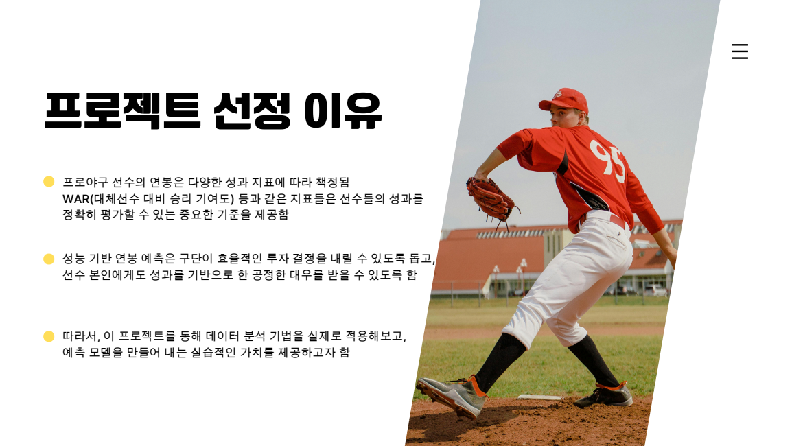

## 📌 개요

본 프로젝트는 KBO 타자들의 성적 데이터를 기반으로,  
다음 시즌 연봉을 예측할 수 있는 머신러닝 회귀 모델을 개발한 분석 프로젝트입니다.  
단순한 성과 지표뿐 아니라 세이버메트릭스(WAR, OPS, wRC+ 등)를 포함한 다양한 변수들을 활용하여  
연봉 책정에 영향을 미치는 요인을 분석하고, 예측 모델을 구축하였습니다.

---

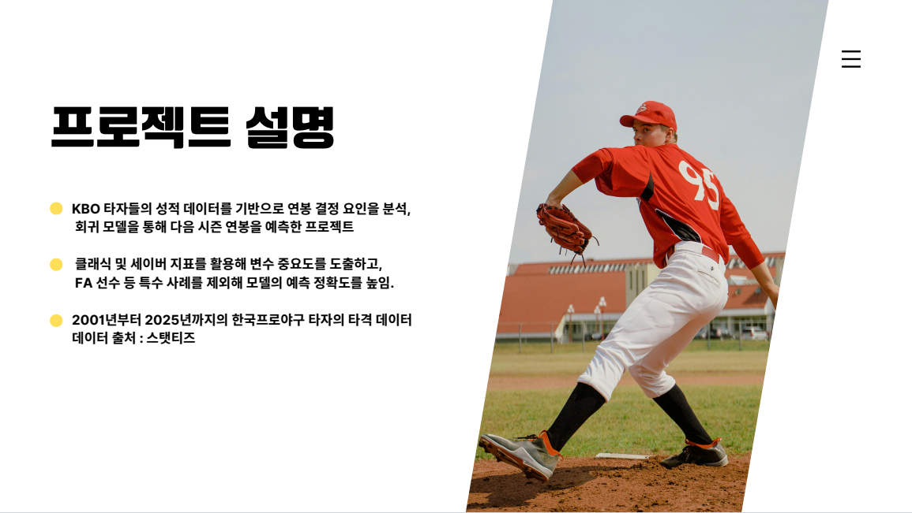

## 📂 데이터 개요

- **기간**: 2001년 ~ 2025년  
- **출처**: [STATIZ](http://www.statiz.co.kr/)  
- **대상**: 한국프로야구(KBO) 소속 타자 전체

---

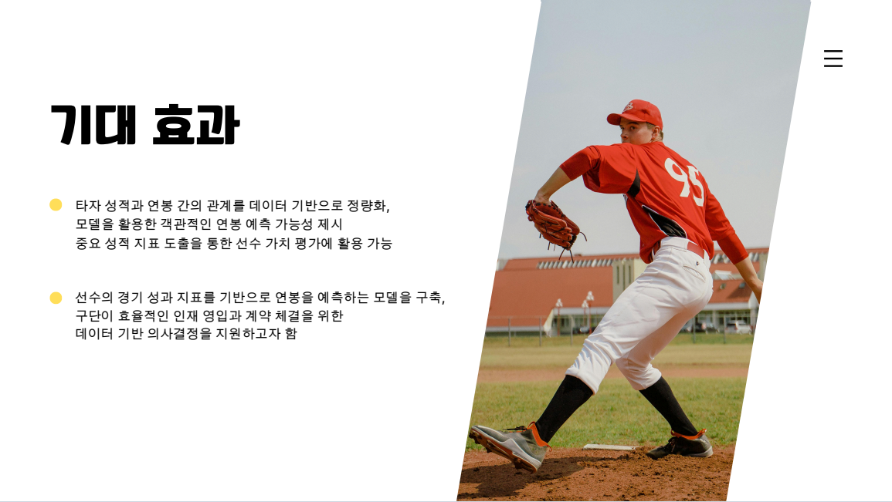

## 🎯 프로젝트 목표 및 기대 효과

- 성과 기반 연봉 예측으로 **구단의 효율적 인재 영입과 계약 전략** 지원
- **선수 본인의 성과에 따른 공정한 대우**에 대한 데이터 기반 근거 제공
- 주요 성과 지표의 중요도를 정량화하여, **선수 가치 평가 기준 제공**

---

## 🧹 데이터 전처리 요약

- `이름 개명/동명이인 처리` (예: 이병규 → 이병규9, 이병규7)
- `FA 여부`, `신인 여부` 변수 추가
- `추신수 선수` 데이터 제거 (비정상적 연봉 패턴)
- `전년도 연봉` 결합 → 전년도 연봉이 없으면 결측 처리
- **FA와 유사한 비FA 다년계약 선수도 FA로 분류**하여 분석

---
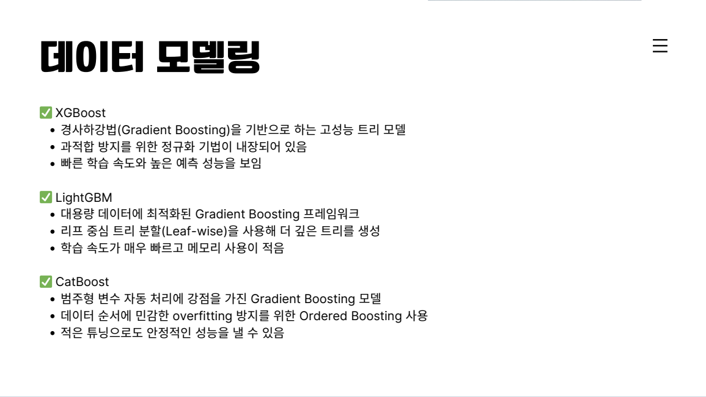

## 🤖 사용한 모델 및 튜닝 방식

- XGBoost
- LightGBM
- CatBoost ✅ (최종 채택 모델)

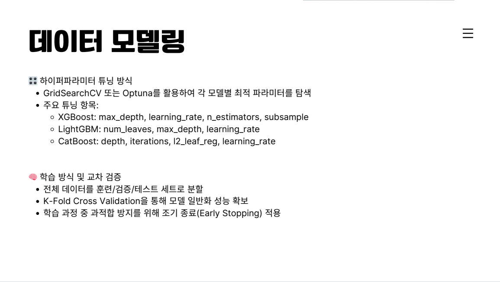
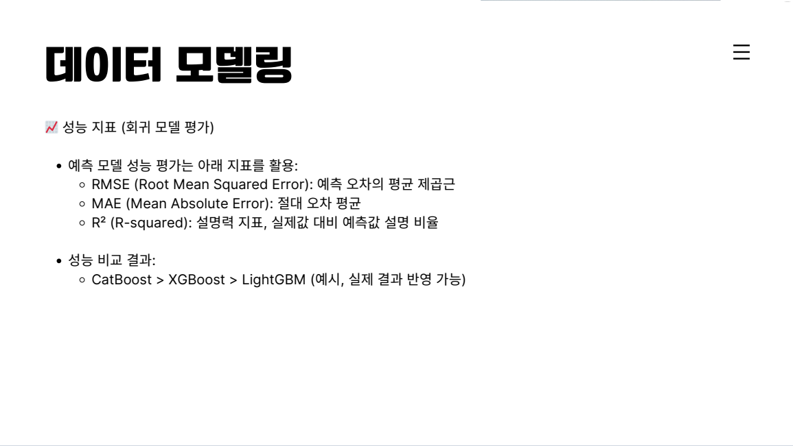

### 🎛 하이퍼파라미터 튜닝
- Optuna 및 GridSearchCV 활용
- 교차 검증(K-Fold CV), Early Stopping 적용
- 주요 파라미터: `depth`, `learning_rate`, `iterations`, `l2_leaf_reg`, `subsample`, 등

---

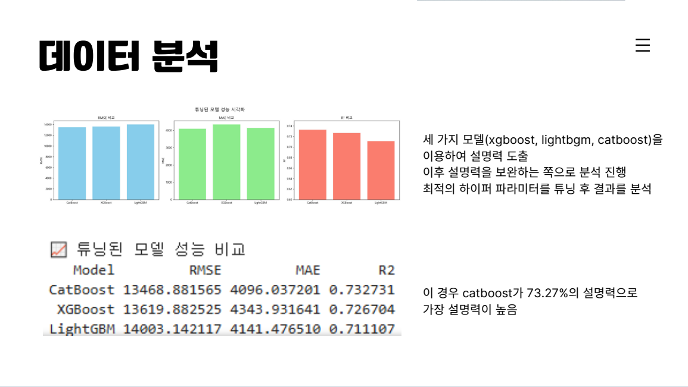
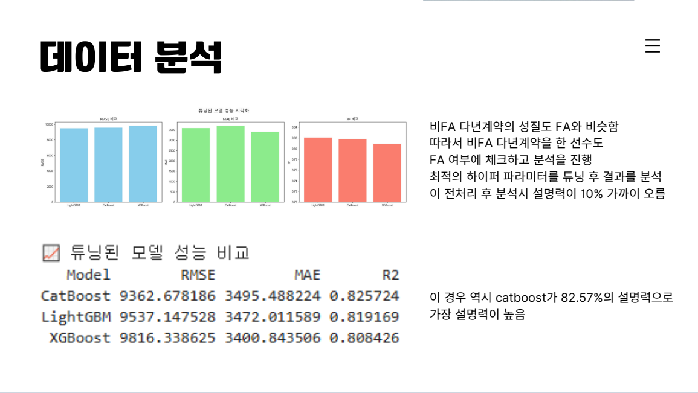
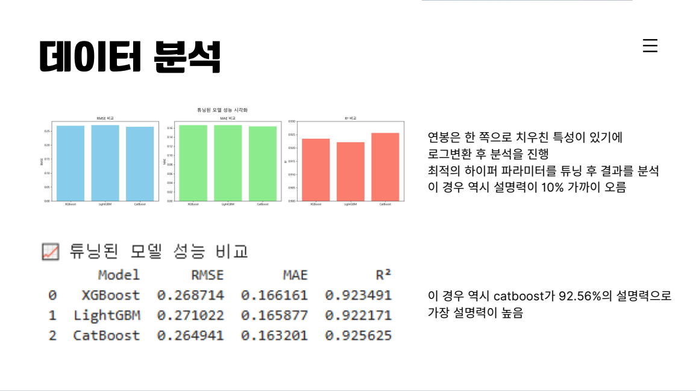

## 📈 모델 성능 비교

| Model     | RMSE   | MAE    | R²     |
|-----------|--------|--------|--------|
| CatBoost  | 0.2649 | 0.1632 | 0.9256 |
| XGBoost   | 0.2687 | 0.1661 | 0.9235 |
| LightGBM  | 0.2710 | 0.1659 | 0.9221 |

> ✅ CatBoost가 가장 높은 설명력을 보여줌

---

## 🔍 변수 중요도 분석

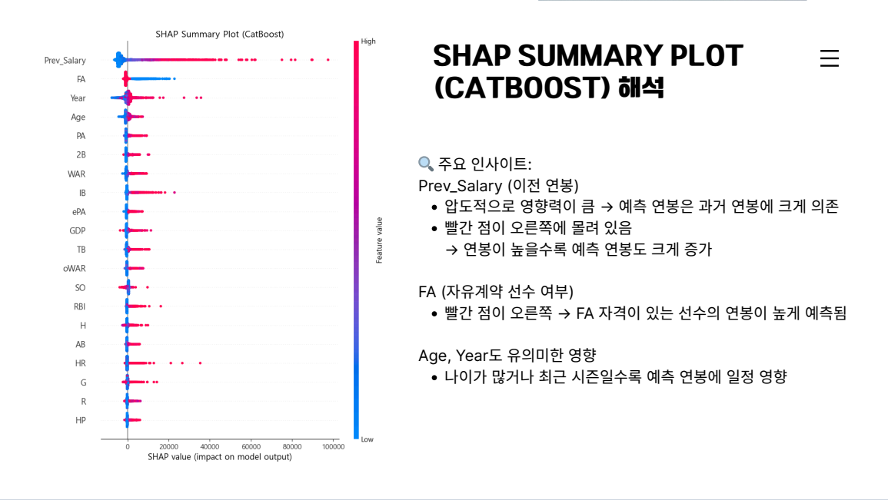

### 🧠 SHAP Summary Plot

- `Prev_Salary`가 예측 연봉에 가장 큰 영향
- `FA`, `Age`, `Year` 등도 유의미한 변수
- 값이 높을수록 예측값을 증가시키는 경향 뚜렷

---

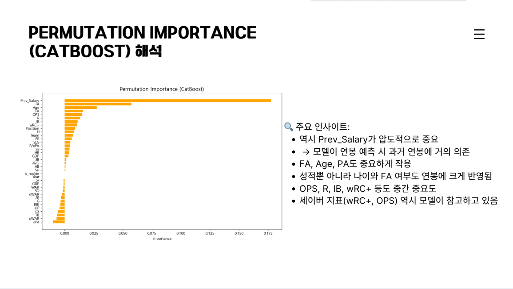

### 🧪 Permutation Importance

- `Prev_Salary`, `FA`, `PA`, `OPS`, `wRC+` 순으로 중요도 높음
- 세이버메트릭스 지표도 연봉에 실질적인 영향력을 가짐

---

## 📊 예측 결과 분석

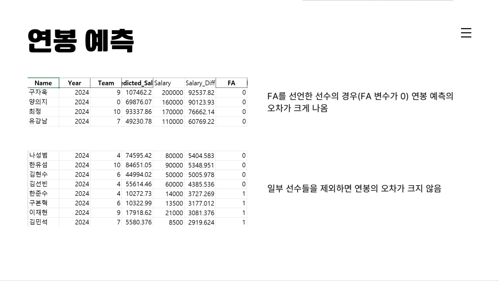
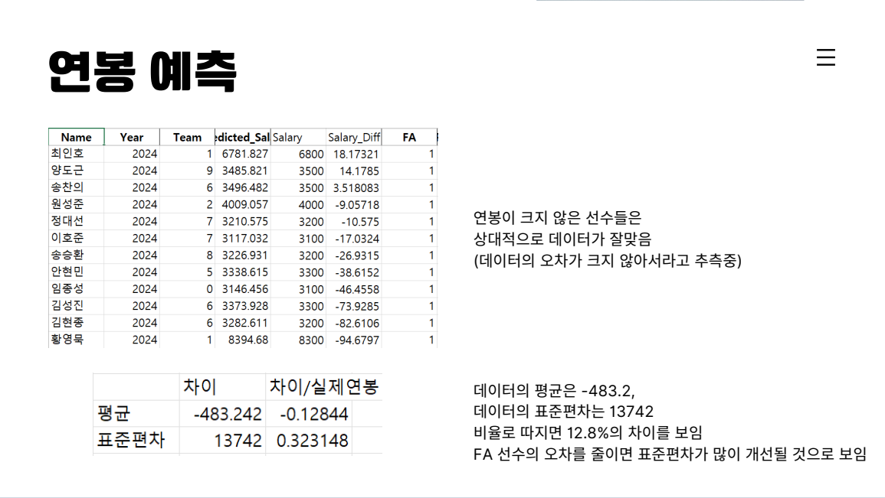

### 예측값 vs 실제값 비교 결과 요약

- **FA 선수 예측 오차가 가장 큼**
- FA가 아닌 일반 선수에 대해서는 상대적으로 높은 정확도
- 오차 평균: `-483.2`, 표준편차: `13,742`
- 오차/연봉의 평균은 약 `-12.8%` 
- FA 선수들의 예외적 연봉을 반영하면 전체 성능 개선 여지 있음

---

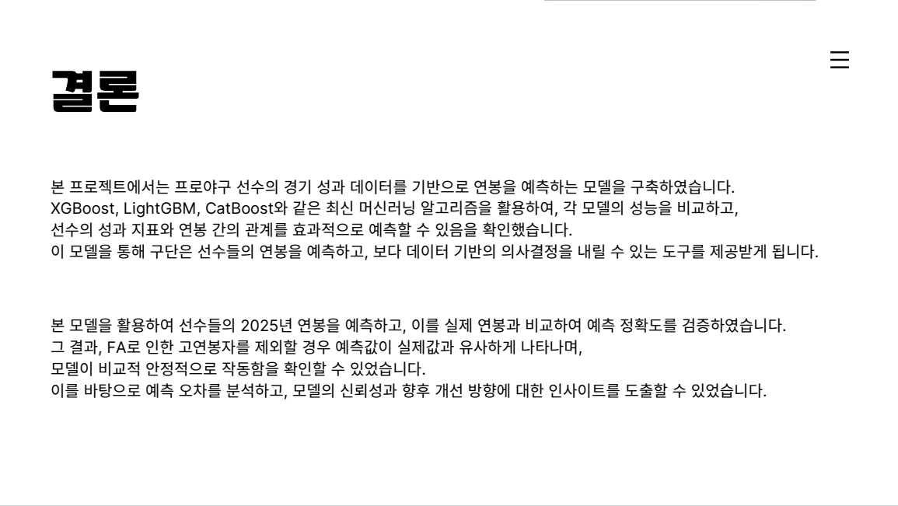

## ✅ 결론

- CatBoost 모델은 타자 연봉 예측에 있어서 **높은 설명력(R² ≈ 92.5%)**을 보였고,  
  SHAP 분석을 통해 연봉 결정 요인을 **정량적으로 도출**할 수 있었습니다.
- 과거 연봉과 FA 여부가 큰 영향을 미쳤으며, 성적 지표 역시 유의미한 변수로 작용하였습니다.
- 향후 FA 유형 세분화, 비정량적 요소 반영 등을 통해 **모델의 정교함**을 높일 수 있을 것으로 기대됩니다.

---

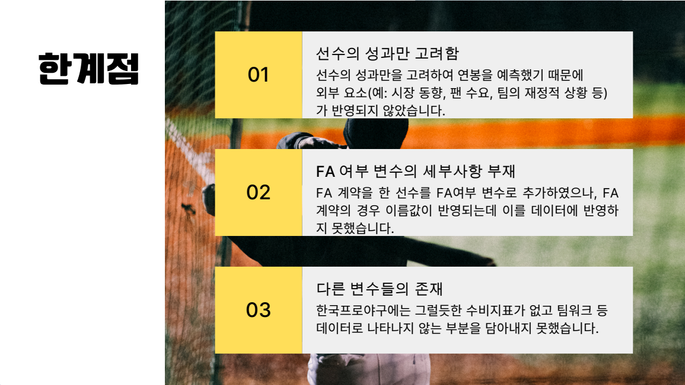

## ⚠️ 한계점

- **외부 요인 미반영**: 시장 가치, 팬 인기, 팀 재정 등 비정량 요소 제외
- **FA 변수 단순화**: FA의 세부 계약 내용, 이적 프리미엄 등을 고려하지 못함
- **수비 지표 부족**: 한국프로야구에서 정교한 수비 데이터가 부족하여 반영 어려움

---

## 📬 Contact

- Yoochan Seo  
- ✉️ yooc3055@gmail.com  
- 📍 Anyang, South Korea  
- 🔗 [GitHub Profile](https://github.com/taekyeon-63)
